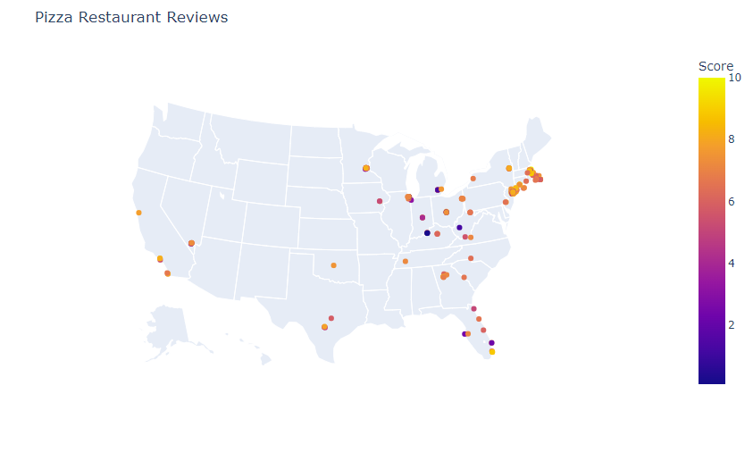

# DS_Invidudual_Project_Avery

## Introduction

Many people believe that their judgement of the best pizza is the best. However, one man’s opinion seemingly reigns the truth over the internet. His name is Dave Portnoy. Dave travels all over the United States trying out new pizza. He has over 1000 reviews and a YouTube channel with millions of subscribers. A good review from him could make a failing small business make it into a local hotspot. 
	Over time, as Dave’s following grew, he created an app called the One Bite app where the community can place their opinions and ratings on other pizza and try and get Dave to give his official score. 

Question 1

One question to be answered is one of the oldest questions of all time. What town has the greatest pizza? Could it be the Chicago deep dish style pizza, or maybe the Detroit style rectangular pizza. And then the biggest rivalry, New York (Specifically Brookyln) VS New Haven. These two cities have been fighting for the title for many years. We will see what Dave thinks the best is. 
	After this we will make a linear regression model to see if the location plays a factor in Dave’s scoring. 

Question 2

Let’s also create a map that displays all the Pizza Restaurants he has reviews with their pinpoints being color coded based off the score. This map is useful to someone in a new area looking for the best pizza place quickly and easily based off their own location. 

Question 3

We will also look at the distribution of Dave’s and the community scoring. Let’s see if Dave and the community tend to favor rating more popular and better tasting pizza. 

Question 4

In this project we are going to create a predictive model to see if we can predict what Dave will score on a restaurant based off various factors such as location, price, current community score, and amount of community reviews. These are factoring that Dave has acknowledged could change his opinion stating that “Vacation Dave gives better reviews than New York”. Meaning that when Dave is traveling to Saratoga Springs or Miami, he often gives better scores. When a pizza is more expensive, he often raises his expectations which could result in lower or higher scores as well. 

## Selection of Data

Model and processing training were done using a Jupyter Notebook available [here](https://github.com/averymatwit/DS_Invidudual_Project_Avery/blob/main/codes/PizzaScoreAnalysis.ipynb)

  The data I selected is directly from the app so it is from a very credible source, you could even describe it as a primary source. The data is old and not up to date with some of his current reviews but there are still over 400 in this set. 
  
  To create a more accurate model, for any community score that was null, I estimated the score based off the scores in the location and Dave’s score. Dave has claimed the community scores do often line up with his so this seemed like a fair method. I also wanted to make sure that local biases were factored into the estimated score which is why I included the average score in the location.
  
  I created a new feature called Is_New_York to determine if Dave is reviewing the pizza in New York City (meaning he is at work) or if he is traveling. Dave has claimed this plays a factor in his scoring because of his mood while traveling.

Data file is available [here](https://github.com/averymatwit/DS_Invidudual_Project_Avery/blob/main/data/pizza_data.csv)

Data preview: 

## Methods

  The methods that were used was a Random Forest Regressor, this was used to train the model. This tool was preferred over others because of its compatibility with Boolean values, numerical values, and categorical values. 
  
  We also used a LinearRegression model to look at the impact longitude and latitude had on Dave’s scores. 
  
  Matplotlib and Seaborn were used to create a bar chart to display which city truly has the best pizza. Plotly express was used to create a map that shows the best pizza places in a location. 

  A new feature was engineered as well which was a Boolean that said if Dave was in New York or not.
  
  The dataset was obtained through a Github user who had a similar curiosity as I did. He downloaded the data from the app and published the set. 

  Google Colab was used as an online IDE because of its accessability

## Results

Question 1 results

We found that the city with the best pizza is New Haven with Brooklyn in second place. Dave has controversially claimed New Haven does have the best tasting pizza with some of his favorites being Frank Pepe’s and Sally’s Pizzeria and it appears that our analysis proves his claims to be true. 

Looking at the Linear Regression model we can see that the longitude and latitude play a very small, almost negligible role in Dave’s scores. The latitude and longitude show some degree of correlation, but the relationships are weak. These factors may be because of differences in pizza styles but the longitude and latitude are not as influential as other factors like community score and price level.

Question 2 results

The map successfully shows all the locations of the pizza restaurants Dave has rated. The color also accurately displays the score that was given. This color display is useful to users because the app doesn’t have a feature like this.

 
Question 3 results

The score distribution graphs display that the community and Dave both favors reviewing good pizza places. The community scores higher rankings and the peak is around 7 to 8. This shows that pizza places that have reviews are more popular in the community. Dave’s scores have a similar pattern, his concentration is in the 6 to 8 range. This distribution graph also shows that Dave scores a little harder than the community, especially with the lower scores where Dave has a lot more in the 0-3 range than the community.

 
Question 4 results

Looking at the Linear Regression model we can see that the longitude and latitude play a very small, almost negligible role in Dave’s scores. The latitude and longitude show some degree of correlation, but the relationships are weak. These factors may be because of differences in pizza styles but the longitude and latitude are not as influential as other factors like community score and price level.

When looking at the plot and the model it does appear that the community and Dave do often agree on pizza scoring. Our model had a Mean Error of 3.35 which is slightly on the higher side but not too far off. Looking at the factors, the community score has the greatest pull with an importance of 92.5% and the price category had an importance of 4% and the factor of the place being in New York or not had an importance of 2%.

## Discussion

These results can help prove the accuracy of Dave's scoring and whether or not his own claims about pizza align with his reviews. These results are important because of how big of a following Dave has on social media. His pizza reviews have great influence of millions of consumers so it is important that he gives accurate reviews and claims. 

This study shows that several of Dave Portnoy's claims have been found true. His statement that New Haven has the best pizza shows in his scoring. This also shows a notable alignment between his reviews and his community review. There are correlations with another project called "The Portnoy Project" which analyzed all of Dave's reviews up to 2020. This dataset was less extensive, but its conclusions are in sync with my findings.

Future research could involve using a more up to date data set up to 2023. Additionally, implementing Yelp reviews to find correlations in addition to Dave's review, and the community review, revealing potential correlations and trends. More future research could be investigating the impact that Dave has on small buisness. Seeing the before and after of a small buisness's income could help Dave make claims on how important he is to the pizza community.

# Summary

The project deploys a Linear Regression Model and a Random Forest Model to estimate Dave's pizza review. With the Linear Regression Model we had a MSE of about 2.2 and with the Forst Model we had a MSE of 3.5. 

The map will assist users to be able to quickly scan for the best pizza place in a location.

We also revealed that many of Dave's claims he makes during his videos are backed by his scores, such as New Haven being the best pizza and that the higher the price, the tougher he grades.

## References
[1] [The Portnoy Project](https://www.libertybrewtours.com/project-portnoy/)

[2] [Adventures in Barstool’s Pizza Data)](https://towardsdatascience.com/adventures-in-barstools-pizza-data-9b8ae6bb6cd1)

